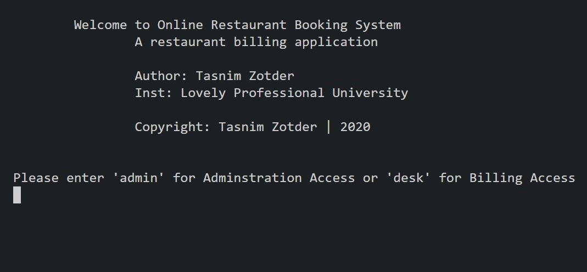
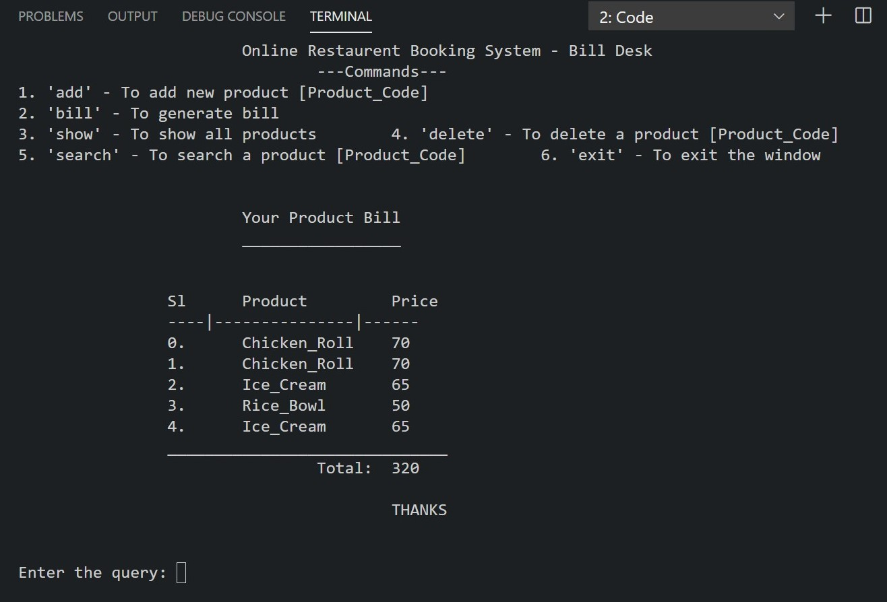

# CSE 202 - Restaurant Billing

<p align="center">
   <a></a>
   <a></a>
   <a></a>
   <a></a>
</p>


## Getting Started

This is a C++ application. The project was given as a semister project of B Tech Computer Science stream in **[Lovely Professional University, Punjab](https://www.lpu.in)**. The goal was to make a **Restaurant Billing System** in which the restaurant admin can view, add, update and delete the products. And the billing desk can view, add, delete and generate the products bill.

## Language Used


<p align="center">
  <a></a>
</p>

## Working

1. The application has a parent class `Restaurant` and it has two child classes `RestAdmin` and `BillDesk`.

   ```cpp
   class Restaurent {};

   class RestAdmin : public Restaurent {};

   class BillDesk : public Restaurent {}
   ```

   > Here `Hierarchical Inheritance` is used.

2. `Restaurant` and `RestAdmin` are included in the main source file and input commands are executed using recursion.

## Commands

## > For Admin User

| Command  | Function                                                        |
| :------: | :-------------------------------------------------------------- |
|  `show`  | To show all products                                            |
|  `add`   | To add a new product `Product_Code`, `Product_Name`, `Price`    |
| `search` | To search a product `Product_Code`                              |
| `update` | To update a product `Product_Code`, (`Product_Name`), (`Price`) |
| `delete` | To delete a product `Product_Code`                              |
|  `exit`  | To terminate the application                                    |

## > For Bill Desk

| Command  | Function                                                     |
| :------: | :----------------------------------------------------------- |
|  `show`  | To show all products                                         |
|  `add`   | To add a new product `Product_Code`, `Product_Name`, `Price` |
| `search` | To search a product `Product_Code`                           |
| `delete` | To delete a product `Product_Code`                           |
|  `bill`  | To generate the bill                                         |
|  `exit`  | To terminate the application                                 |

## Author

> [Tasnim Zotder](https://github.com/tasnimzotder)

## Snapshots

### Home Page



### Products Bill


